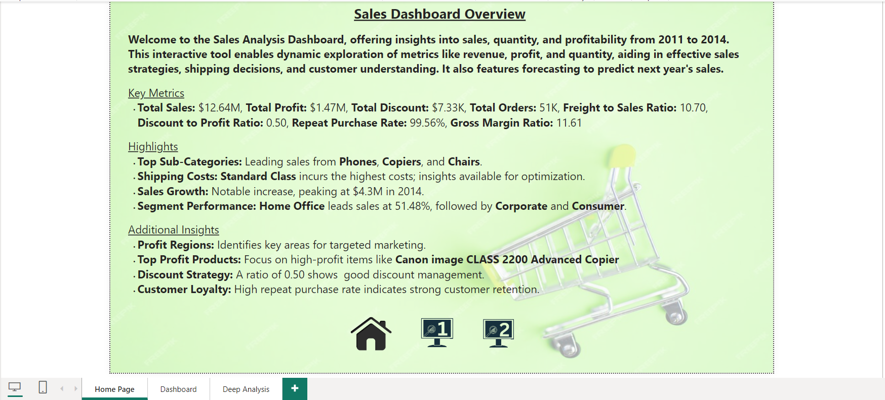

# 📊 Sales Analysis Dashboard

Welcome to the **Sales Analysis Dashboard**! This interactive tool analyzes sales data from **2011 to 2014**, providing insights to enhance sales strategies and improve profitability.

## 🚀 Key Features
- **Interactive Metrics**: Explore total sales, profit, discounts, and order quantities.
- **Dynamic Forecasting**: Predict upcoming sales using historical data.
- **Visual Insights**: Analyze trends in shipping costs, sales growth, and segment performance.

## 📈 Key Metrics
- **Total Sales**: $12.64M
- **Total Profit**: $1.47M
- **Total Discounts**: $7.33K
- **Total Orders**: 51K
- **Freight to Sales Ratio**: 10.70%
- **Discount to Profit Ratio**: 0.50
- **Repeat Purchase Rate**: 99.56%
- **Gross Margin Ratio**: 11.61%

## ✨ Highlights
- **Top Sub-Categories**: Leading sales from **Phones**, **Copiers**, and **Chairs**.
- **Shipping Insights**: **Standard Class** incurs the highest shipping costs.
- **Sales Growth**: Peak sales of **$4.3M** in **2014**.
- **Segment Performance**: **Home Office** leads with **51.48%** of sales.

## 📊 Additional Insights
- **Profit Regions**: Identify key areas for targeted marketing.
- **Top Profit Products**: Focus on high-margin items like the **Canon imageCLASS 2200 Advanced Copier**.
- **Customer Loyalty**: Strong retention with a **99.56%** repeat purchase rate.

